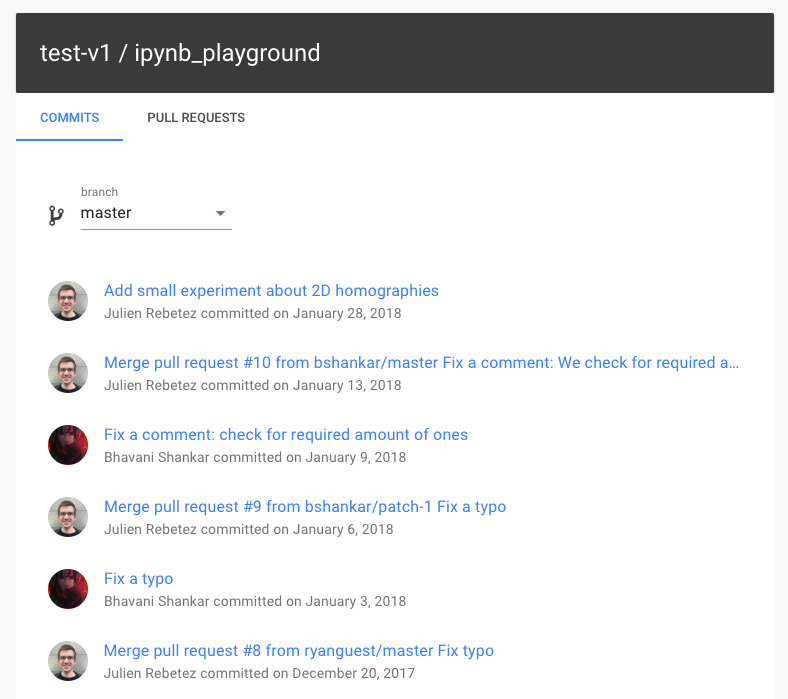
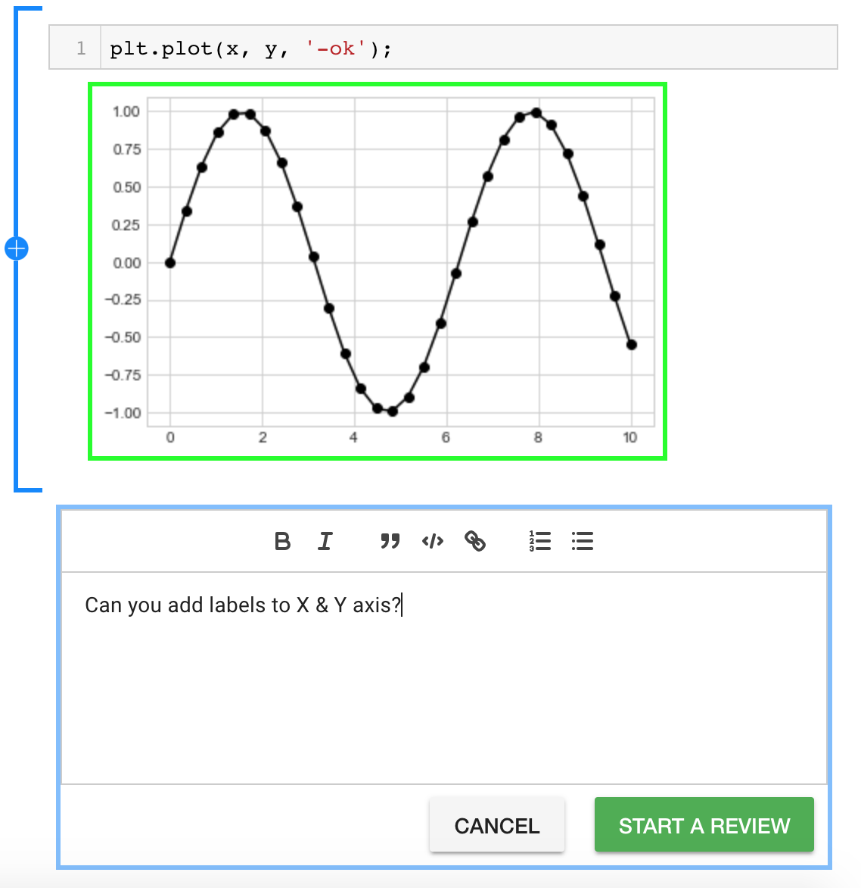

.. include:: globals.rst

Features
===============

* **You can see visual diff for notebook changes.**

.. image:: ./images/f1.png
   :scale: 45 %
   :align: center

|br| |br|

* **Visual diff is available for all commits and pull requests on your GitHub repositories.**

|br|

* **You can write comments on Pull Request diffs to ask clarifying questions, suggest changes etc. All comments are posted to GitHub.**

|br|

* **Conversation threads to track all open discussions before a PR can be merged.**

.. image:: ./images/f4.png
   :scale: 45 %
   :align: center

|br|

* **Bot comments on PR to make it easy to jump from GitHub PR to ReviewNB PR page.**

.. image:: ./images/f5.png
   :scale: 45 %
   :align: center

|br|

* **Install ReviewNB on repositories of your choice.**

.. image:: ./images/f6.png
   :scale: 60 %
   :align: center

|br|
