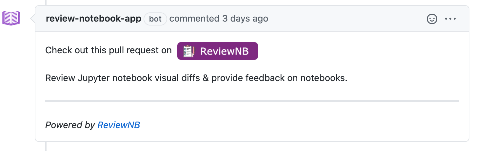

.. include:: ../globals.rst

.. _bot_comments:

Verify Bot Comments
=====================

.. note::
  This verification happens at the very end after ReviewNB is installed and you can login succesfully.

Anytime a new Pull Request is opened (containing notebook changes), our bot posts a comment to access this Pull Request in ReviewNB. See screenshot below. It's a very useful feature to quickly jump from GitHub to ReviewNB.

This is achieved by listening to webhooks generated by GitHub & shouldn't require any additional setup. Let's just go ahead and verify that this feature is working as expected.

How to Verify
*********************
- Login to ReviewNB and allow access to some repositories from the UI.
- Create a new Pull Request on one of these repositories. Make sure the PR contains at least one notebook file change.
- Once the PR is created, you should almost instantly see bot comment on the Discussion tab in GitHub.

If you are not seeing bot comments there's likely something wrong with GitHub webhook delivery. You can take following troubleshooting steps,

- Head over to your newly created GitHub App -> Advanced Tab. You can see webhook delivery failure reasons.
- If all webhook deliveries are failing with 'Service Timeout' or similar errors. Please make sure that your GitHub enterprise instance can make outbound calls to your on-prem ReviewNB.
- Look at container logs (``docker logs <container-id>``) to see if logs are complaining about something.
- If still not resolved, write to us at `support@reviewnb.com`
