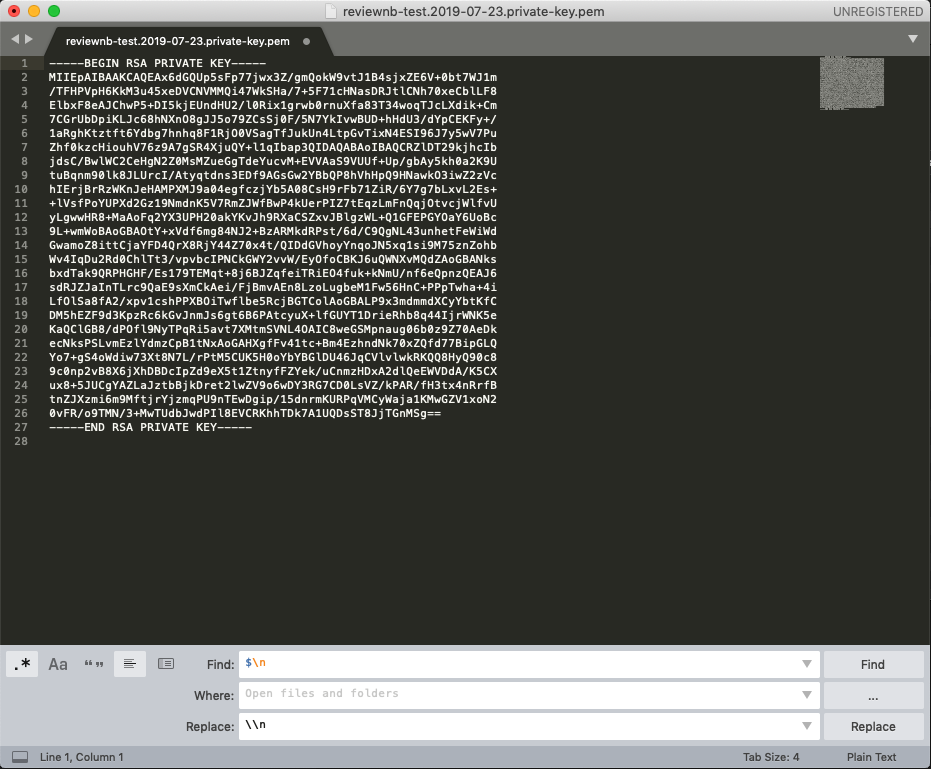

.. include:: ../globals.rst

.. _create_github_app:

Create GitHub App
=================
GitHub application forms the bridge between ReviewNB and GitHub. It enables user authentication via Oauth2 & lets user select repositories that ReviewNB should have access to.

In this section, we'll create a GitHub app for your self hosted ReviewNB installation. At the end, we require following fields to use inside our ReviewNB installation.

* App ID
* App URL
* Client ID
* Client secret
* Private Key

.. note::
  Throughout this document when we say GitHub account, it can be an individual/org account on github.com or your own GitHub enterprise installation, depending on the GitHub offering you are using.

Prerequisite
--------------------------
* You need to know the endpoint at which you'll be running ReviewNB. It's typically *reviewnb.<your-domain-name>.com*. Your application won't be running there as yet but you just need to know the endpoint you'll be using.

Create New App
---------------------
Any GitHub account can own the app but we recommend creating it under org account of the team who is going to maintain the ReviewNB installation.

* Login to GitHub & go to your org account page (e.g. https://github.corp.company.com/tools-org).
* Click on *Settings -> GitHub Apps -> New GitHub App* as shown below.

.. image:: ../images/gh_app_1.png
   :scale: 60 %
   :align: center

Setup URLs and Genral Information
----------------------------------
Fill in the general information as shown in the screenshot. For URLs, replace *reviewnb.<your-domain-name>.com* with actual endpoint at which you'll be hosting ReviewNB application.

.. note::
  Do not forget trailing slashes for the URLs.

.. image:: ../images/gh_app_2_v2.png
   :scale: 60 %
   :align: center

Setup Permissions
-----------------------
We need following permissions for enabling all the ReviewNB functionality,

* Read *repository contents* to fetch notebooks and compute diff
* Read *repository metadata* to fetch list of commits and PRs
* Read-Write access to *pull requests* to read & write PR comments
* Read access to *emails* for user profiles (**Optional**, older GitHub Enterprise do not have email permission)

You need to enable these under permissions section as shown below,

.. image:: ../images/gh_app_3.1.png
   :scale: 80 %
   :align: center

.. image:: ../images/gh_app_3.3.png
   :scale: 80 %
   :align: center

.. image:: ../images/gh_app_3.4.png
   :scale: 80 %
   :align: center

Webhook Events & Scope
-------------------------
* Subscribe to Pull Request events so ReviewNB is notified when a PR is created and it can post the ReviewNB link on the PR discussion.
* For the question, *"Where can this GitHub App be installed?"* choose *"Any account"* so other orgs in your company can use ReviewNB as well.

Click on *Create GitHub App*

Generate Private Key
-----------------------------
Once the app is created you can scroll down and click *Generate a private key*. This will create and download a .pem file for you. Please keep this safe.

.. image:: ../images/gh_app_5_v2.png
   :scale: 80 %
   :align: center

.. _get_app_config:

Get App Config
-----------------------------
On your newly created app page, you can find Client ID, Client Secret, App ID, and App URL. Please note down these fields along with the private key generated in the above step. We'll need to plug them as environment vaiables on the docker container.

Public link is our App URL and ID is App ID.

How to read Private Key
-----------------------------
The private key you generated above would be downloaded as a .pem file. You need to open the .pem in any text editor and replace the newlines with *\\n*. I demonstrate this with Sublime Text below.

Notice the regex replacement I'm using at the bottom. If your editor doesn't support it, you can manually replace newlines with *\\n*.

It should become a single line (like below) after replacement. If you're replacing by hand, notice there's a *\\n* at the end of last line as well. This will be your Private Key (*GITHUB_APP_PEM*).

.. image:: ../images/after_replacement.png
   :scale: 80 %
   :align: center

Summary
---------------------------------
At the end of this section you should have following values to be used as environment variables for ReviewNB container.

* App ID (*GITHUB_APP_ID*)
* App URL (*GITHUB_APP_URL*)
* Client ID (*GITHUB_CLIENT_ID*)
* Private Key (*GITHUB_APP_PEM*)
* Client secret (*GITHUB_CLIENT_SECRET*)
