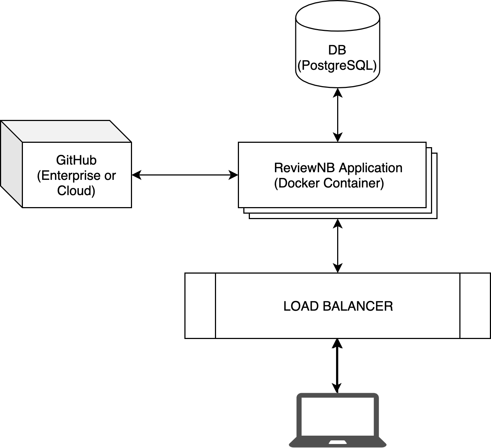

.. include:: ../globals.rst

Overview
=====================

This is an architectural overview of ReviewNB's self hosted offering. The application is distributed as a docker image via |Quay|.
Application communicates with your GitHub repositories & offers a code review workflow for your Jupyter notebooks stored in GitHub repositories.

There are 3 main components -

- PostgreSQL DB (stores user identity, GitHub metadata, notebook comments)
- Actual application (distributed as a docker image)
- GitHub App (to identify the client making GitHub API calls)

In a self hosted setup you create & fully control all the 3 components above. Here's our :ref:`step-by-step installation guide <docker_installation>`.

FAQ
----------------

Does ReviewNB work with GitHub Enterprise?
  Yes. Our self hosted installation works with GitHub Enterprise & GitHub.com both.

How long does it take to setup a self hosted ReviewNB instance?
  It takes about ~2 hours to set everything up.

How much effort is required for maintenance?
  - There's no maintenance required of you apart from periodic updates.
  - We notify you when an update is available. Update process shouldn't take more than a few minutes (you simply pull docker image with the new tag)

Does the application makes any call back to "home"?
  No. The application does **not** make any calls back to ReviewNB infrastructure. Even the licensing information is pre-baked into your docker image.

How secure is self hosted ReviewNB?
  Most important thing for us & all our self hosted customers is security & privacy of their data/notebooks. With that in mind, here's our security design overview -

    - The application does not make any calls back to ReviewNB infrastructure. All the data is stored securely under your own control.
    - You can (and should) restrict the outbound access of ReviewNB service only to Github.com & your own SMTP server (except for fetching data from GitHub & sending emails to users, the application does not need to talk to outside world)
    - You can (and should) restrict the inbound access to your own corporate VPN. Nobody outside your company network can access the ReviewNB application.
    - You can (and should) **only** allow inbound access to PostgresDB from ReviewNB application.
    - GitHub API key for the user is stored in DB with AES encryption.
    - Every time a user logs out and logs back in we create a new GitHub API key (as part of the GitHub OAuth login flow), effectively making the old keys defunct.
    - Our app has been |verified by GitHub| team & approved for sell on GitHub marketplace. You can see **Verified by GitHub** badge on our |marketplace listing|.

  Our self hosted offering has been reviewed, approved & currently being used by organizations such as AirBnB, Lyft, Deloitte, Royal Bank of Canada, NASA JPL & many more.
